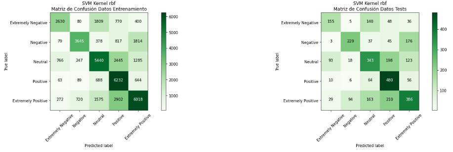

# Análisis de Sentimientos

## Descripción:
Este trabajo busca la implementación de 2 modelos para analizar los sentimientos en los tweets que hablan sobre el Covid-19, para luego poder clasificarlos en 5 clases; los modelos implementados son la Máquina de Vector de Soporte y el Preceptrón Multi Capa (SVM &amp; MLP).

## Tabla de Contenidos 
- [Datos](#datos)
- [Metodología](#metodología)
- [Resultados](#resultados)
- [Conclusión](#conclusión)

## Datos 
- El dataset utilizado contiene un registro de twitts del año 2020, los cuales están relacionados o hablan acerca del Covid.

## Metodología 

### 1. Limpieza de Datos 
- Se eliminó las columnas innecesarias, solo se utilizó la columna con el contenido del twitt y otra columna con la etiqueta que representa el tipo de sentimiento que da a entender el twitt.

### 2. Normalización de Datos 
- Se quitaron en los textos los "\n" (Saltos de líneas), "\r" (Retorno de Carro) y "\t" (Tabulaciones).
- Todas las palabras de convirtieron en minúsculas.
- También se filtraron las palabras que se utilizarían; se quitaron los signos de puntuación, palabras vacías, menciones, url, hashtags y dominios.
- Despues se convirtieron las palabras filtradas a su forma base.
- Al final se recontruyeron los textos con las palabras resultantes.
- Se normalizaron las etiquetas convirtiendolos a valores numéricos.

### 3. Bolsa de Palabras 
- Se convierte el texto en una matriz de características, donde cada elemento de la matriz representa la frecuencia de la palabra en el texto.
 

### 4. Implementar los Algoritmos
- Se implementaron 2 algoritmos distintos para ver cuál da mejores resultados:
  - Perceptrón Multi Capa (MLP)
  - Máquina de Vector de Soporte (SVM)

### 5. Entrenamiento de los Modelos 
- Se usaron los datos limpios para entrenar los algoritmos.
- Se utilizaron gráficas para ver el accuracy y loss del algoritmo.

### 6. Evaluación de los Modelos
- Se evaluó con las métricas de "accuracy", "precision", "recall" y "f1".
- Las matrices de confusión para cada modelo dio resultados buenos, sobre todo el del MLP.
- Perceptrón Multi Capa (MLP):

- Máquina de Vector de Soporte (SVM):

## Resultados 
- Se pudo comparar ambos resultados de cada algoritmo con los mismos datos, lo cual el que dio mejores resultados fue el algoritmo MLP.
- Pero el algoritmo SVM no se alejó mucho de los resultados del otro algoritmo.

## Conclusión
Aunque los algoritmos anteriores funcionaron de manera decente, creo que se debería escoger para este tipo de problemas una Red Neuronal Recurrente (RNN), puesto que estas están diseñadas para trabajar con palabras.
